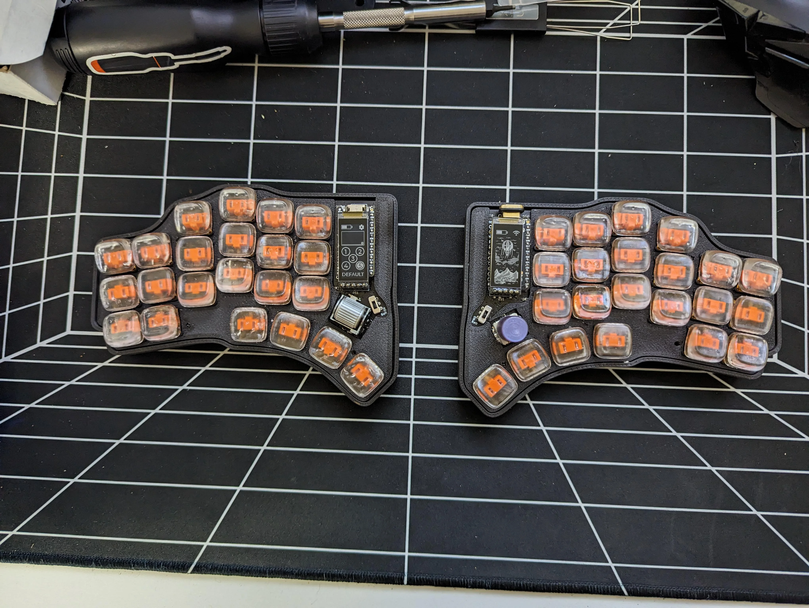

ZMK keymaps
===========

This repo contains ZMK firmware configuration for my split keyboards.

## Hillside View

[Hillside View](https://github.com/wannabecoffeenerd/HillSideView/) is a fork of [Hillside 46] with support for sharp display, bottom side MCU and future Cirque trackpad support.

### Layout

Keymap SVG is rendered via `keymap-drawer` — see `artifacts/keymap-drawer/hillside_view.svg`.

Layers: Base, Num-Sym, Nav, FKeys, Training.

German (DE) locale keys via [zmk-locales](https://github.com/joelspadin/zmk-locales).
Home-row mods using urob-style "timeless" hold-tap configuration.
